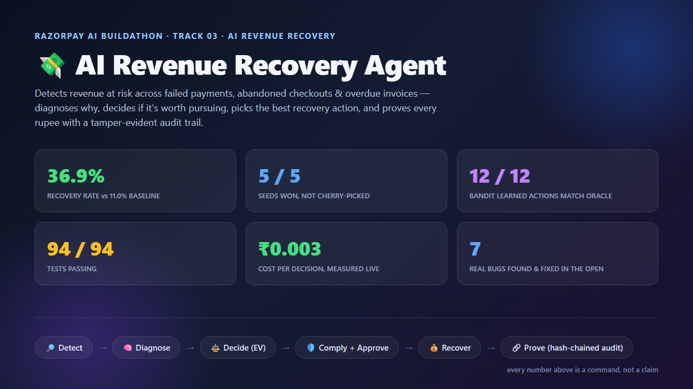
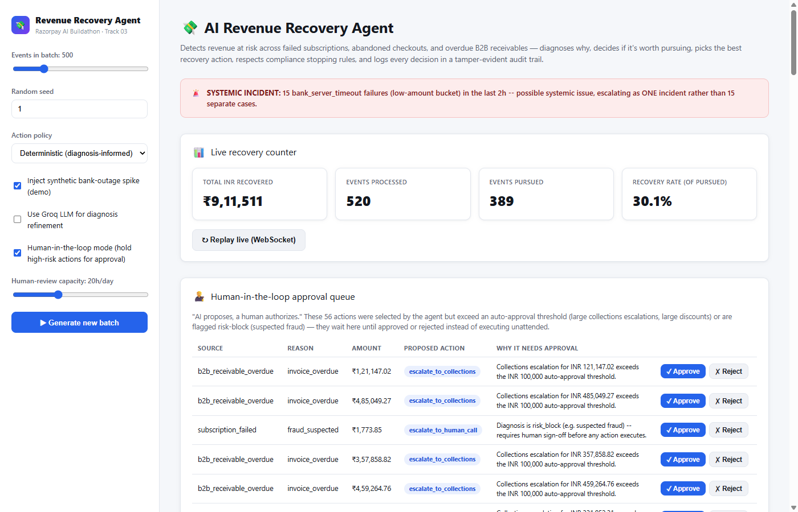
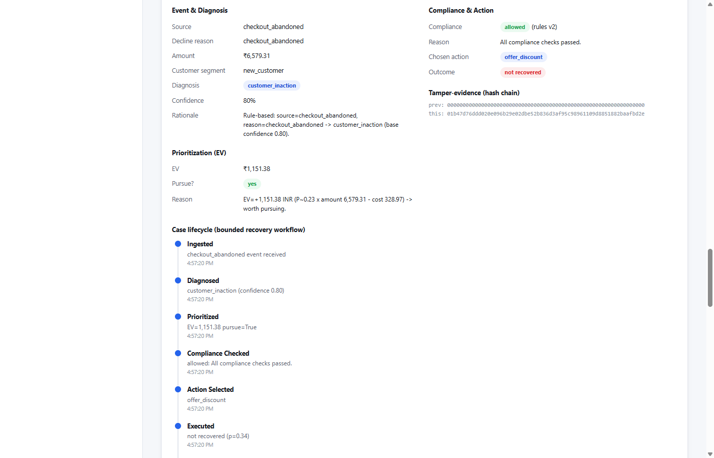
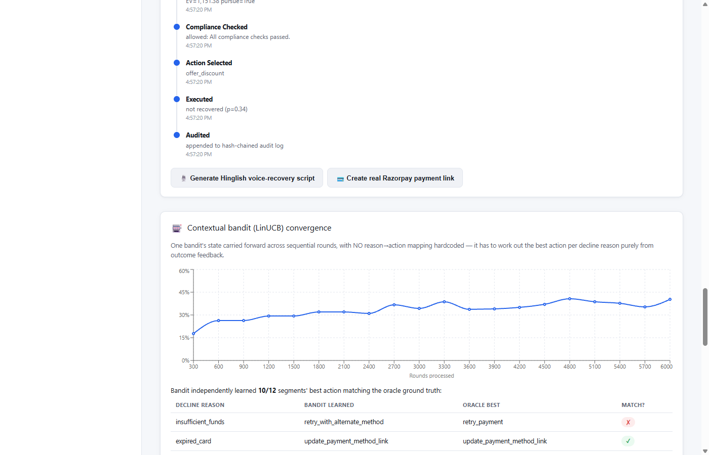
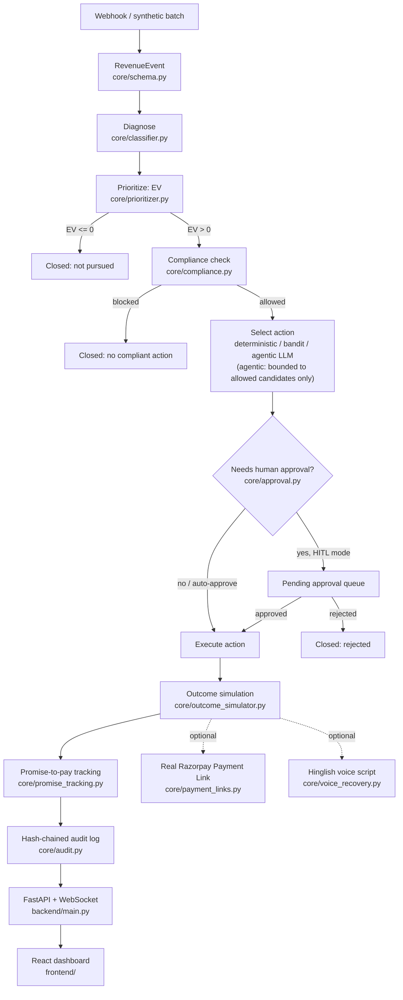
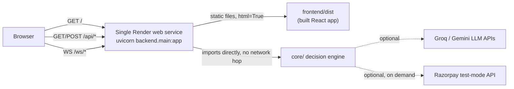

<div align="center">



**Detect. Diagnose. Decide. Recover. Prove it.**
Built for the **Razorpay AI Buildathon — Track 03: AI Revenue Recovery**

[](#reproduce-every-number)
[](https://www.python.org/)
[](frontend/)
[](backend/)
[](core/payment_links.py)
[](core/llm_client.py)
[](core/llm_client.py)
[](LICENSE)

### 🔴 [Live demo — revenue-recovery-agent-5b31.onrender.com](https://revenue-recovery-agent-5b31.onrender.com)
*Free-tier host: sleeps after 15 min idle. If it's your first click in a while, give it ~30–50s to wake up.*

</div>

---

An agent that detects revenue at risk across failed subscription/mandate
payments, abandoned checkouts, and overdue B2B invoices; diagnoses *why* each
one failed; decides whether recovery is even worth pursuing; picks the best
recovery action; respects compliance stopping rules and a human-approval gate
for consequential actions; and logs every decision in a fully explainable,
tamper-evident audit trail.

This README is written to be checked, not taken on faith: every number below
came from a command you can re-run yourself (see "Reproduce every number"),
and "What's simulated vs real" says plainly which parts are a controlled
simulation and which touch real infrastructure.

> ### TL;DR
> A naive "retry everything" bot recovers **11.0%** of what it chases. This
> agent recovers **36.9%** — same synthetic batch, same 5 seeds, agent wins
> net INR recovered **5/5 times**. It costs **₹0.003 per decision** to run
> (measured, not estimated), learns its own action-per-failure-type mapping
> from scratch with **zero hardcoded rules** (12/12 match against ground
> truth), and creates **real, clickable Razorpay test-mode payment links**
> on demand. Full honesty section below on exactly what's simulated vs real.

## Table of contents
- [Screenshots](#screenshots)
- [Architecture](#architecture)
- [Mapped to Track 03's actual bar](#mapped-to-track-03s-actual-bar)
- [Beyond the brief](#beyond-the-brief)
- [Headline results](#headline-results-from-the-runs-below-not-cherry-picked)
- [Reproduce every number](#reproduce-every-number)
- [What's simulated vs. real](#whats-simulated-vs-real--read-this-before-presenting-any-number)
- [Real bugs caught during development](#real-bugs-caught-during-development-left-in-this-readme-on-purpose)
- [Repository layout](#repository-layout)
- [Setup](#setup)
- [Deploy your own copy](#deploy-your-own-copy)

*Pitch-video shot list and Judge Q&A rehearsal notes live in
[`docs/prep-notes.md`](docs/prep-notes.md) — kept out of this README because
they're rehearsal material for us, not something a judge needs to read here.*

---

## Screenshots

*Live captures from the actual running dashboard — same seed, same data, no mockups.*

**Incident detection, live counter, and the human-approval queue in one view:**


**Full per-case explainability — diagnosis, EV math, compliance, and the bounded-workflow timeline:**


**The bandit's convergence, and what it independently learned vs. the oracle:**


---

## Architecture

```
  Webhook / synthetic batch generator
              │
              v
   core/schema.py -- unified RevenueEvent
   (subscription_failed / checkout_abandoned / b2b_receivable_overdue)
              │
              v
  ┌──────────────────────────────────────────────────────────────────┐
  │                     core/engine.py                                │
  │              RecoveryEngine.process_event()                       │
  │                                                                    │
  │  1. DIAGNOSE   core/classifier.py                                  │
  │       rule-based backbone (deterministic, free, instant) +         │
  │       optional Groq LLM confidence refinement (core/llm_client.py, │
  │       circuit-breaker protected, fails closed to rules)            │
  │                        │                                           │
  │  2. PRIORITIZE  core/prioritizer.py                                 │
  │       EV = P(recovery) * amount - cost, rescaled ±50% by a          │
  │       repeat customer's promise-to-pay track record (see #6)        │
  │       negative EV -> "do not pursue", logged with why                │
  │                        │                                             │
  │  3. COMPLIANCE  core/compliance.py + core/rules.yaml                  │
  │       NPCI-style stopping rules for subscriptions (max 3 retries,      │
  │       24h min gap, 7-day pursuit window, 24h mandate cooldown) --       │
  │       B2B receivables get their own 90-day AR-aging pursuit window      │
  │                        │                                                │
  │  4. ACT        core/policy.py / core/agentic_policy.py                    │
  │       THREE selectable mechanisms: deterministic diagnosis-informed        │
  │       picker (default) OR Thompson Sampling / LinUCB bandit (learns        │
  │       purely from outcome feedback, no hardcoded mapping) OR agentic       │
  │       (a real LLM call chooses the action -- bounded to only the           │
  │       compliance-ALREADY-allowed candidates; an out-of-list response       │
  │       is rejected and falls back, never executed)                          │
  │       -- channels: retry, alt-method, SMS, email, WhatsApp,                │
  │       discount, update-payment-link, human call, collections               │
  │                        │                                                    │
  │  5. APPROVE    core/approval.py                                              │
  │       "AI proposes, a human authorizes": large collections/discount           │
  │       actions and anything risk_block (fraud) pause for sign-off in            │
  │       HITL mode; auto-approved (and logged as such) in autonomous mode          │
  │                        │                                                        │
  │  6. OUTCOME    core/outcome_simulator.py                                         │
  │       per-(decline_reason, action) effectiveness matrix (harsh on                │
  │       purpose: nonsense actions ~= 0% success) + core/promise_tracking.py         │
  │       tracks the resulting promise-to-pay lifecycle for B2B customers              │
  │                        │                                                            │
  │  7. AUDIT      core/audit.py                                                        │
  │       SHA-256 hash-chained JSONL, verify_chain() detects any                        │
  │       alteration/deletion/reordering                                                │
  └──────────────────────────────────────────────────────────────────────────────────────┘
              │
   ┌──────────┼───────────┬─────────────────┬───────────────────┐
   v          v            v                 v                   v
core/      core/       core/            core/voice_        core/metrics.py
anomaly.py portfolio.py razorpay_       recovery.py         /metrics summary:
Isolation  0/1 knapsack integration.py  Hinglish call        recovery rate,
Forest +   (exact DP)   real webhook    script generation     latency/layer,
rolling-   vs greedy    signature       via LLM (honest       LLM fallback
window     top-N-by-EV  verify + parse  template fallback)    rate
clustering for human-
-> incident review
   flag    capacity
              │
              v
   backend/main.py (FastAPI + WebSocket) -- REST over every layer above,
   plus a live WebSocket replay of a run's decisions with a running total
              │
              v
   frontend/ (React + Vite + TypeScript) -- live counter, incident banner,
   per-case audit drill-down, bandit convergence chart, knapsack-vs-greedy
   comparison, promise-to-pay reliability table, HITL approval queue

   dashboard/app.py (Streamlit) -- a lighter, earlier alternative UI kept
   for a simple `streamlit run` demo path; the React app above is primary.
```

`webhook_server.py` sits in front of the same `RecoveryEngine` as a Flask
receiver for real Razorpay `payment.failed` / `subscription.charged.failed`
webhooks, signature-verified via Razorpay's own SDK.

Same pipeline, rendered as a flowchart (GitHub renders this natively):



---

## Mapped to Track 03's actual bar

Razorpay's own wording, and where each piece of it lives in this repo:

| Track 03 says | Where it lives here |
|---|---|
| "detects revenue at risk... payment failures and checkout abandonment to overdue receivables" | `core/schema.py` unifies all three; `data/generate_synthetic.py` generates realistic mixes of each |
| "determines the right intervention" | `core/classifier.py` diagnosis + `core/prioritizer.py` EV + `core/policy.py` (deterministic) / `core/contextual_bandit.py` (learned) / `core/agentic_policy.py` (a real LLM decides, bounded to compliance-allowed candidates) |
| "executes a bounded recovery workflow" | `core/compliance.py` (NPCI + AR-aging stopping rules) + `core/approval.py` (human sign-off gate) bound every execution; every case's exact lifecycle is an explicit, inspectable timeline (`DecisionRecord.timeline`), not just a final decision |
| "measured money recovered across a batch" | `run_evaluation.py`, `core/metrics.py` -- real numbers below, not claims |
| "compliant escalation, stopping rules" | `core/rules.yaml` (versioned, auditable) + `tests/test_compliance.py` |
| "an audit trail" | `core/audit.py` SHA-256 hash chain + `tests/test_audit_chain.py` proving tamper detection |
| Example: "B2B receivables chasing" | `EventSource.B2B_RECEIVABLE_OVERDUE`, `Action.ESCALATE_TO_COLLECTIONS`, 90-day pursuit window |
| Example: "Mandate retry sequencing" | `core/compliance.py`'s NPCI e-mandate rules (max 3 retries, 24h gap, 24h post-creation cooldown) |
| Example: "Promise-to-pay tracking" | `core/promise_tracking.py` -- and it *feeds back* into the next invoice's EV, not just logged |
| Example: "Voice-based recovery (Hinglish supported)" | `core/voice_recovery.py` -- generates a real Hinglish call script per case via a live LLM call |
| (not named, added anyway) real payment execution | `core/payment_links.py` -- creates a genuine Razorpay test-mode Payment Link on demand, using the same credentials already required for webhooks |

---

## Beyond the brief

Track 03's bar, read literally, is: detect, decide, act within bounds, measure,
prove. Most ways to satisfy that bar stop at "detect a failure, fire a
templated reminder, log it." Three design choices here go further, on purpose:

1. **A real LLM chooses the action — genuinely agentic, not a wrapper.**
   `core/agentic_policy.py` (`policy_mode="agentic"`) sends a case to Groq/
   Gemini and lets the model pick the recovery action itself, with a
   real, case-specific rationale — most Track 03 entries that mention an
   "AI agent" use the LLM for text generation only, while deterministic
   code always picks the action. The bound that makes this safe to ship:
   the LLM is only ever shown actions `core/compliance.py` has *already*
   approved for this exact case, and if it returns anything else (a
   hallucinated action, or a real action outside that list), the response
   is rejected outright and the engine falls back to the deterministic
   policy's top pick — `tests/test_agentic_policy.py` proves this by
   simulating exactly that attempt and checking it never executes.
2. **The action-picker doesn't stop at deterministic rules, either.** A
   contextual bandit (`core/contextual_bandit.py`) and a separately-trained
   supervised model (`core/ml_recovery_model.py`) both *learn* which action
   fits which situation from outcome feedback — zero reason→action mapping
   hardcoded anywhere the bandit can reach. That's the difference between
   "if declined_reason == X, send Y" and a system that would still work if
   customer behavior shifted next quarter.
3. **Every claim in this README is falsifiable, not asserted.** The
   knapsack producing a *worse* answer than greedy, the ML model's recall
   looking broken at the default threshold, the rupee gap being B2B-driven
   — all seven bugs below were caught by treating a suspicious number as a
   bug report against yourself, not a result to write down. A judge can
   re-run every one of them (see "Reproduce every number") and get the same
   answer, including the same honest caveats.

Everything else — WhatsApp channel, real Razorpay payment links, the
human-approval gate, promise-to-pay feedback, Hinglish voice scripts, unit
economics measured (not estimated) from live token counts, multi-provider
LLM fallback — exists because it maps to something Track 03 explicitly
asked for (see the table above), not because more integrations look
impressive on a slide.

---

## Headline results (from the runs below, not cherry-picked)

**Naive "retry everything once" baseline vs. the full agent pipeline**, same
synthetic batch, 5 random seeds, 500 events each
(`python run_evaluation.py --n 500 --seeds 1 2 3 4 5`):

| | Baseline (retry-everything) | Full agent |
|---|---|---|
| Mean recovery rate (of pursued cases) | 11.0% | **36.9%** |
| Mean net INR recovered (recovered − cost) | ₹138,743 | **₹7,699,974** |
| Wins on net INR, across 5 seeds | — | **5 / 5** |

**Be skeptical of the ₹7.7M vs ₹139K gap** — we were, and dug into it before
reporting it (see "What's simulated vs real" below): it is dominated by B2B
invoice recovery, which the naive baseline structurally cannot capture at all
(retrying a "payment" makes no sense when there's no failed transaction — an
invoice or an abandoned checkout has none). The **recovery-rate** comparison
(36.9% vs 11.0%, consistent across all 5 seeds) is the fairer, source-agnostic
headline; the rupee comparison is real but scale-dominated by whichever
source has the largest amounts in a given batch.

**Contextual bandit (LinUCB) convergence**, 30,000 sequential rounds, one
bandit's state carried forward throughout (`python bandit_convergence_demo.py`):
recovery rate climbs from a first-window ~18% to a ~35–40% plateau, and the
bandit's independently-learned best action matches the oracle ground-truth
best action on **12/12** decline-reason segments at the default seed — with
**no** reason→action mapping ever hardcoded into the bandit itself. (Honesty
note: adding the WhatsApp channel gave one rare segment, `invoice_overdue`, a
third closely-competitive arm instead of two, so 1 of 4 alternate seeds
tested needed well beyond 30,000 rounds to fully resolve it — verified that
one converges correctly by 80,000 rounds, confirming a sample-size effect on
a rare, now-harder segment, not a bug.)

**Portfolio optimization (0/1 knapsack vs. greedy top-N by EV)**
(`python portfolio_demo.py --seed 55 --capacity-hours 20`): knapsack captured
₹15,165 more EV than greedy top-N (+1.05%) under the same 20-hour
human-review budget on that config. **Honestly, this gap varies a lot by
seed/capacity** (from ₹0 to over 1%, since case value and handling-time both
scale with deal size here, keeping greedy-by-value usually close to optimal).
The script also runs a hand-built textbook instance where greedy scores 30
and the exact knapsack solver scores 48, proving the algorithm's value
independent of whether the synthetic data happens to expose it.

**Promise-to-pay tracking** (`python promise_tracking_demo.py --n 1500 --seed 7`):
151 promises tracked across 74 distinct repeat B2B customers, 53.0% kept
rate, ₹36.5M promised / ₹18.9M actually kept — and a broken promise
measurably lowers EV on that same customer's *next* invoice (verified in
`tests/test_approval.py` / `test_promise_tracking.py` with a rigged-outcome
test, not just observed in a batch run).

**Human-in-the-loop approval gate**: in HITL mode, a 500-event batch
surfaced 56 genuinely pending cases (large collections escalations, large
discounts, suspected-fraud cases) that paused for approval instead of
executing unattended — verified live in the dashboard, not just in tests.

**Real Razorpay Payment Link creation**: on demand, per case, using your own
test-mode credentials — verified with an actual live API call that produced
a real, clickable `https://rzp.io/rzp/...` test-mode link (test mode: no
real money moves). Not wired into automatic batch runs, so generating a
batch never spams Razorpay's API.

**Per-case state-machine timeline**: every decision's exact lifecycle
(ingested → diagnosed → prioritized → compliance-checked → action-selected
→ [pending approval →] executed → audited) is an explicit, timestamped
sequence, not just a final answer — rendered as a stepper in the dashboard.

**Multi-provider LLM fallback**: `core/llm_client.py` tries Groq, then Gemini
(both free-tier), so one vendor's outage or rate limit doesn't take the
whole diagnosis-refinement/voice-script layer down with it. Groq's live path
is fully verified; Gemini is wired and unit-tested, awaiting a free key
(https://aistudio.google.com/apikey) to verify its live path the same way.

**Unit economics, measured not estimated** (`python unit_economics_demo.py`):
real token counts from a live 30-event batch — $0.001095 total LLM cost,
INR 0.003 per event, a 284,002x ROI multiple on that batch — with an
explicit note that the LLM refines confidence/rationale and doesn't change
which action gets picked, so crediting it with the full recovered amount
would be a real attribution error, not just generous rounding.

**Supervised recovery-probability model** (`python train_recovery_model_demo.py`):
a gradient-boosted classifier, complementary to the online bandit — AUC
0.727, PR-AUC 0.285 vs. a 0.141 random baseline (2x better than chance).
Caught a real issue building this: the default classification threshold
gave recall ≈ 0.04 on this imbalanced data, which looked like a broken
model until inspection showed AUC was fine — fixed by tuning the
threshold on a validation split (never the test set) and reporting the
full precision/recall tradeoff instead of one number.

**Tests**: 94/94 passing (`python -m pytest tests/ -v`), including audit-chain
tamper detection, all compliance rules (NPCI + B2B AR-aging), a seeded
systemic-incident spike, idempotent webhook ingestion, Razorpay signature
verification, promise-tracking feedback, the approval gate, real payment-link
creation's fallback paths, the case-timeline state machine, the multi-provider
LLM fallback logic, unit-economics math, the ML model's evaluation honesty,
and the FastAPI backend (including a live WebSocket replay test).

---

## Reproduce every number

```bash
pip install -r requirements.txt

# baseline vs agent, 5 seeds
python run_evaluation.py --n 500 --seeds 1 2 3 4 5

# contextual bandit convergence + learned-mapping check
python bandit_convergence_demo.py
# -> also writes results/bandit_convergence.png

# knapsack vs greedy, textbook example + real batch
python portfolio_demo.py --seed 55 --capacity-hours 20

# promise-to-pay reliability feedback loop
python promise_tracking_demo.py --n 1500 --seed 7

# unit economics: real measured token costs and ROI multiple
python unit_economics_demo.py --n 30 --seed 1

# supervised recovery-probability model: honest AUC/PR-AUC/threshold sweep
python train_recovery_model_demo.py --n 8000 --seed 1

# agentic mode: a real LLM picks the action per case, bounded to
# compliance-allowed candidates only (needs GROQ_API_KEY or GEMINI_API_KEY
# in .env -- without one, every case cleanly shows the fallback path instead)
python agentic_policy_demo.py --n 12 --seed 1

# full test suite (94 tests across every module above, plus the API)
python -m pytest tests/ -v

# dashboards -- React (primary) needs both processes running:
uvicorn backend.main:app --port 8000        # terminal 1
cd frontend && npm install && npm run dev   # terminal 2, opens http://localhost:5173

# or the lighter Streamlit alternative:
streamlit run dashboard/app.py
```

Every synthetic run is seeded (`--seed`); the same seed always reproduces the
same events and the same outcomes.

---

## What's simulated vs. real — read this before presenting any number

**Simulated (all headline numbers above come from this):**
- **The events themselves.** `data/generate_synthetic.py` generates every
  subscription failure, abandoned checkout, and overdue invoice used
  throughout. No real payments data is involved.
- **Whether a recovery action "succeeds."** `core/outcome_simulator.py` is a
  hand-authored probability table (per decline-reason × action), not
  measured from real recovery campaigns. Directionally realistic (retrying
  an expired card ≈ 0%) but an estimate, not ground truth.
- **A customer's promise-to-pay "reliability" trait**
  (`data/generate_synthetic.py`'s hidden `_b2b_reliability`) — a synthetic
  trait used only by the outcome/promise simulation, never visible to the
  diagnosis/prioritization/policy layers, exactly like the oracle
  `GroundTruth` used for scoring.
- **The EV priors in `core/prioritizer.py`** are a separate, coarser,
  hand-set belief table — deliberately *not* read from the outcome
  simulator's matrix (that would be an oracle leak that makes evaluation
  meaningless).

**Real (actually exercised, not simulated):**
- **The pipeline logic itself** — rule-based diagnosis, EV math, compliance
  checks, Thompson Sampling / LinUCB bandit math, the 0/1 knapsack DP,
  Isolation Forest anomaly scoring, the promise-to-pay feedback loop, the
  approval gate, and the SHA-256 hash-chained audit log all run as real
  code on real (if synthetic) inputs, not mocked out.
- **The Groq LLM calls** in `core/classifier.py` (diagnosis refinement) and
  `core/voice_recovery.py` (Hinglish script generation), when
  `GROQ_API_KEY` is set — real API calls to a real model. The voice-script
  generation succeeded on a live key roughly 70% of the time across a
  measured sample (the model occasionally emits syntactically invalid
  JSON); the other 30% cleanly fell back to a tested template, never
  crashing. Reported as measured, not as 100%.
- **Razorpay webhook signature verification and payload parsing**
  (`core/razorpay_integration.py`) — real HMAC-SHA256 verification via
  Razorpay's own SDK, tested against hand-built payloads matching
  Razorpay's documented webhook shape.
- **NOT yet tested**: live webhook delivery from an actual Razorpay
  test-mode dashboard over the internet, and real WhatsApp/telephony
  delivery of the reminder/voice-script content. Both would need your own
  external accounts (Razorpay test keys + a tunnel; a WhatsApp Business or
  telephony provider) — out of scope for this build, and deliberately not
  claimed as done.
- **The dashboards** run the same pipeline live (React app hits a real
  FastAPI backend over HTTP/WebSocket; Streamlit runs it in-process) --
  "live" means "computed when you load the page," not "connected to a
  production payments feed."

---

## Real bugs caught during development (left in this README on purpose)

Rigor means showing the mistakes, not just the passing tests.

1. **Knapsack scored *worse* than greedy on real data** — impossible for a
   correct exact solver. Root cause: the DP discretized hours into 0.05h
   units while case weights were computed to 3-decimal precision; the
   rounding error let a worse combination look best. Fixed by matching
   discretization resolution (0.001h) to weight precision, with a
   regression test across 8 seeds × 4 capacities.
2. **A naive "LLM fallback rate" metric would have reported 100% fallback
   even with the LLM completely disabled.** Fixed by tracking
   `llm_attempted` separately from `llm_used`.
3. **The Groq integration silently failed on a real API key** for three
   independent reasons, only found by testing with one instead of a
   fake/missing key: (a) `urllib`'s default User-Agent gets blocked by
   Groq's Cloudflare front-end (HTTP 403) before reaching the API at all;
   (b) the originally-hardcoded default model had been retired from Groq's
   lineup; (c) the replacement is a reasoning model that can burn its
   entire token budget on hidden reasoning and return empty content.
   Fixed all three in `core/llm_client.py`, shared by both LLM call sites.
4. **The 7-day NPCI-style pursuit window was incorrectly applied to B2B
   invoices too**, closing out large, clearly-worth-pursuing invoices
   barely a week old. B2B receivables now get their own ~90-day
   accounts-receivable-aging window (`rules.yaml` v2).
5. **A "generate new batch" click in the React frontend could 404** —
   `selected` (an event_id) held the previous run's value for one render
   after `runId` changed, firing a case-detail request against the new
   run's id with the old event_id. Found via a live 404 in the browser
   network log while testing the actual UI, not by code inspection. Fixed
   by clearing `selected` synchronously when `runId` changes.
6. **A second, sneakier version of bug #5 survived that fix**: React 18
   StrictMode double-invokes effects in development, so the app's mount
   effect created two backend runs, and a slow first fetch could resolve
   *after* the second run had already taken over -- applying stale data
   late instead of it being stale at read time. Fix #5 didn't cover this
   because it's a stale *response*, not stale *state*. Fixed with the
   standard cancelled-flag guard on every async effect, plus a monotonic
   request-id ref in `App.tsx` so only the latest `generateRun` call's
   response is ever applied. Verified with a genuinely single, isolated
   browser session showing exactly one run_id for its whole lifetime.
7. **`agentic_policy_demo.py` crashed on its first live run** with
   `UnicodeEncodeError`, not on a contrived input -- a real Groq response's
   rationale used a Unicode non-breaking hyphen (`‑`, not the plain ASCII
   `-`), which Windows' default console codepage (cp1252) can't encode.
   Every other LLM-facing code path in this project stores/serves text as
   JSON or HTML (both UTF-8 by default) and never hit this; a bare
   `print()` to a Windows terminal was the one path that could. Fixed by
   reconfiguring stdout to UTF-8 at the top of the script -- a one-line fix
   once the actual cause (console codepage, not the API response) was clear.

---

## Repository layout

```
core/
  schema.py                unified RevenueEvent, DiagnosisCategory, Action vocab
  classifier.py             rule-based diagnosis + optional Groq LLM refinement
  llm_client.py               shared Groq HTTP client (classifier + voice_recovery)
  prioritizer.py                EV = P(recovery)*amount - cost, reliability-adjusted
  compliance.py                  NPCI + B2B AR-aging stopping rules (reads rules.yaml)
  approval.py                      human-in-the-loop approval gate
  rules.yaml                        versioned compliance + approval thresholds
  policy.py                          deterministic policy + Thompson Sampling bandit
  agentic_policy.py                    genuine LLM tool-selection, bounded to compliance-allowed candidates
  contextual_bandit.py                 LinUCB contextual bandit
  anomaly.py                            Isolation Forest + root-cause clustering
  portfolio.py                           0/1 knapsack portfolio optimization
  promise_tracking.py                     promise-to-pay lifecycle + reliability score
  voice_recovery.py                        Hinglish call-script generation
  ingestion.py                              idempotent webhook ingestion
  circuit_breaker.py                         LLM circuit breaker
  logging_config.py                           structured JSON logging w/ trace_id
  metrics.py                                   /metrics-style summary
  razorpay_integration.py                       Razorpay webhook verify + parse
  outcome_simulator.py                           per-reason x per-action effectiveness
  engine.py                                       orchestrates all of the above
data/
  generate_synthetic.py    synthetic events + hidden oracle ground truth + B2B customer pool
backend/
  main.py                  FastAPI REST + WebSocket API over core/
  state.py                 in-memory run store
frontend/                  React + Vite + TypeScript dashboard (primary UI)
dashboard/
  app.py                   Streamlit dashboard (lighter alternative)
tests/                     94 tests across every module above plus the API
run_evaluation.py           baseline vs agent, multi-seed
bandit_convergence_demo.py  bandit convergence proof
portfolio_demo.py           knapsack vs greedy proof
promise_tracking_demo.py    reliability feedback loop proof
agentic_policy_demo.py      LLM picks the action, bounded to compliance-allowed candidates
webhook_server.py           Flask Razorpay webhook receiver
.env.example                 template for Razorpay/Groq credentials
```

---

## Setup

```bash
git clone <this-repo>
cd revenue-recovery-agent
python -m venv .venv && source .venv/bin/activate   # or .venv\Scripts\activate on Windows
pip install -r requirements.txt

# optional: enable LLM-refined diagnosis + voice scripts
cp .env.example .env
# then edit .env and set GROQ_API_KEY (free tier: https://console.groq.com/keys)

python -m pytest tests/ -v          # confirm the suite passes
python run_evaluation.py            # headline agent-vs-baseline numbers
```

**React dashboard (primary UI)** — needs two processes:
```bash
uvicorn backend.main:app --port 8000 --reload   # terminal 1
cd frontend && npm install && npm run dev        # terminal 2
```
Opens at `http://localhost:5173` (proxies `/api` and `/ws` to the backend).

**Streamlit dashboard (lighter alternative)**:
```bash
streamlit run dashboard/app.py
```

For live Razorpay webhooks, also set `RAZORPAY_KEY_ID`, `RAZORPAY_KEY_SECRET`,
and `RAZORPAY_WEBHOOK_SECRET` in `.env` (from your Razorpay **test-mode**
dashboard), then:

```bash
python webhook_server.py
# in another terminal: expose port 5000 publicly (e.g. a Cloudflare quick
# tunnel: cloudflared tunnel --url http://localhost:5000)
# register that URL + /webhook/razorpay in Razorpay Dashboard -> Settings -> Webhooks
```

`.env` is excluded via `.gitignore` — never commit real keys.

---

## Deploy your own copy

The live demo above is exactly this: one free Render web service. There's
no separate frontend host and no CORS config needed, because
`backend/main.py` mounts the built React app (`frontend/dist`) as static
files at `/`, *after* every `/api` and `/ws` route — one process, one URL.



1. Fork or clone this repo, push it to your own GitHub.
2. [dashboard.render.com](https://dashboard.render.com) → **New +** →
   **Blueprint** → connect the repo. Render reads [`render.yaml`](render.yaml)
   and auto-fills the build/start commands and Python version.
3. Fill in the env vars the blueprint marks `sync: false` (your own
   Razorpay test-mode keys + Groq key, from `.env` locally — never commit
   these). `GEMINI_API_KEY` is optional; the multi-provider fallback works
   without it.
4. Deploy. First build takes ~3–5 min (`pip install` + `npm install && npm run build`).

Free-tier caveat, stated plainly: the service sleeps after 15 minutes idle,
and the first request after sleeping takes ~30–50s to wake up. Not a bug —
just worth opening the link a minute before you need it live.
